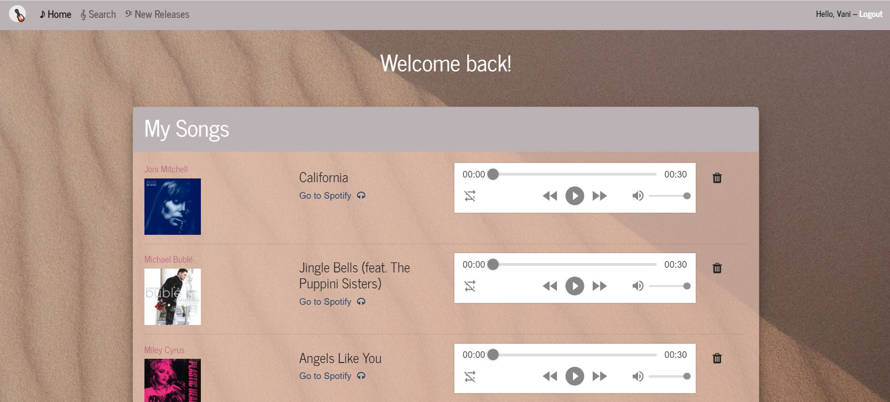
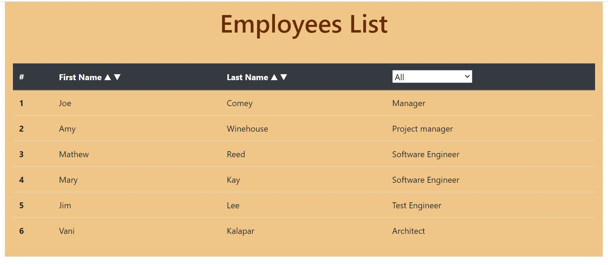
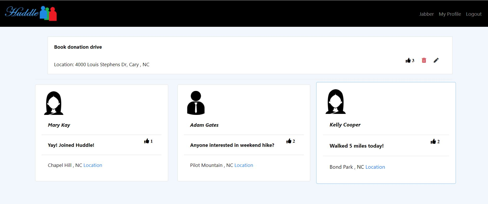
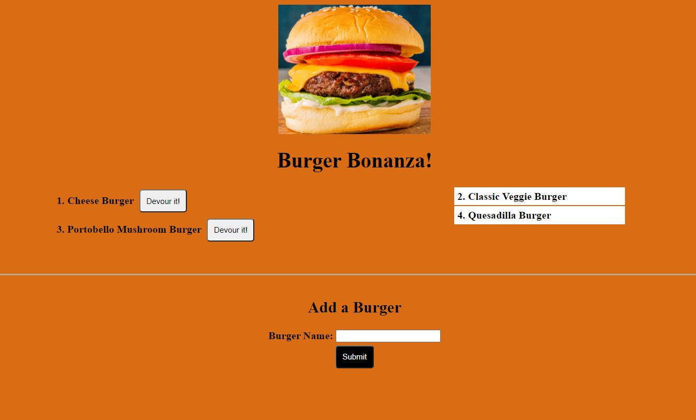
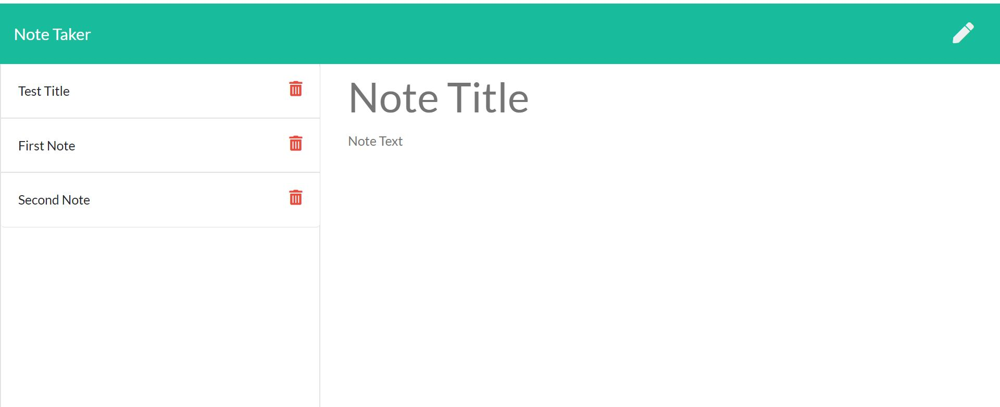
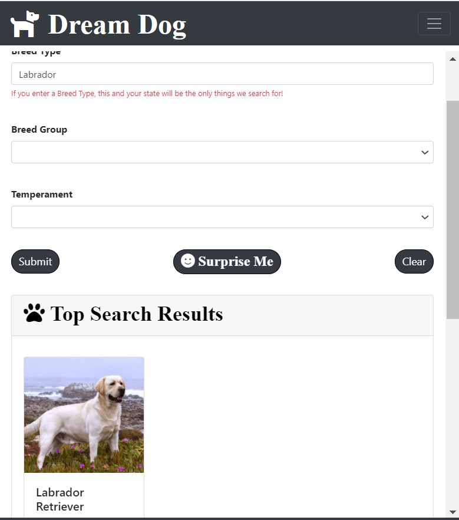
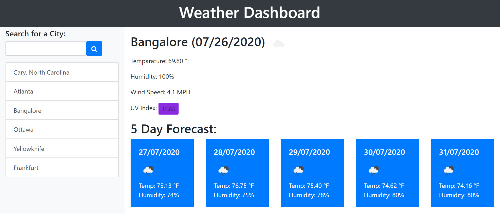

# vkalaparthy.github.io

This is a GitHub user page designed and developed using ReactJS, providing Routes to 3 different pages that serve specific purpose.  

It uses a common component called "NavBar", which also indicates the current active page that is rendered.  
The "MainBlock" is used to display the selcted active content of the page based on the options in the NavBar, which are "About Me", "Portfolio" & "Contact".  
Finally a "Footer" that is common to all Pages.  

About Me page gives a brief descripion about me and my technical skill sets. This page also provided my Contact information and links to my GitHub, LinkedIn and Resume.  

Portfolio page provides the Applications with deployed link and also the GitHub repository information.    
The following Porfolio projects are avaliable: 

* jamEZ - jamEZ is an application that allows users to browse artists and songs, add songs to a list, preview songs, view songs on Spotify, and browse newly-released songs using authenticated user accounts. This application is deployed in Heroku. 

  

* Employee Directory - Created an employee directory using React library. This application's UI is broken down into components, manage component state, and responds to user events. This application is deployed in Heroku. 

  

* Huddle - This is an appication that is designed using Express, Handlebars, Sequelize ORM using MySQL database. Users have to be registered and Authenticated using passport. Huddle page is responsive and uses Bootstrap framework.  

  

* Burger Bonanza - This is a burger logger with MySQL, Node, Express, Handlebars and handmade ORM. used MVC design pattern to break the application into 3 parts.  

  

* Note Taker - Created only backend for this application that can be used to write, save, and delete notes. This application uses an express backend and it saves and retrieves note data from a JSON file.  

  

* Dream Dog - An application that runs in a browser and features dynamically updated HTML, CSS, and JavaScript. Utilizes The Dog API and PetFinder API to allow a user to search for dogs in a selected state by either inputting a breed type or both a breed group and temperament. This was a group project with 4 contributors.  

  

* Weather Dashboard - This is a weather Dashboard, which provided Today's weather along with 5 day forecast by using third-party APIs which allow developers to access their data and functionality by making Ajax request using JQuery.  

   

* Code Quiz - This is a timed Quiz on HTML and Javascript fundamentals that any student can take and store the high scores to check the progress and comapre with peers. This application uses Browser's local storage and responsive.  

Contact page is still under construction.